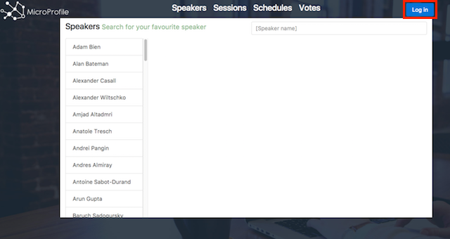
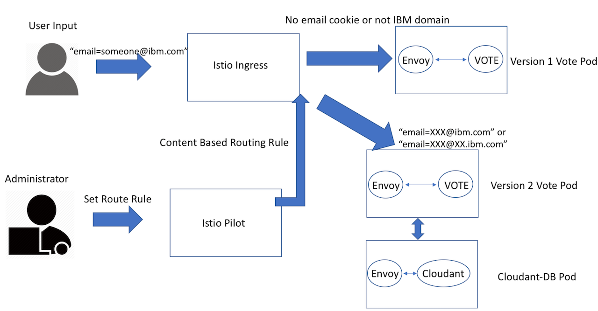

# Create a content-based routing for your microservices

## Prerequisite
Make sure you go through step 1 and 2 in the main [README](README.md) before proceeding to the following steps.

Now you have 2 different version of microservice vote sample, let's create a new Istio route rule to split the traffic based on their login information. First, we need to build our custom webapp image that has login function. So, run 

```shell
cd web-app
mvn clean package
cd ..
docker build -t registry.ng.bluemix.net/<namespace>/webapp web-app
docker push registry.ng.bluemix.net/<namespace>/webapp
sed -i '' s#"microservice-webapp"#webapp# manifests/deploy-webapp.yaml #For Mac user
sed -i s#"microservice-webapp"#webapp# manifests/deploy-webapp.yaml #For Linux user
```

Now, delete our previous deployment and deploy our new webapp.
```shell
kubectl delete -f manifests/deploy-webapp.yaml
kubectl apply -f <(istioctl kube-inject -f manifests/deploy-webapp.yaml)
```

Clear your MicroProfile's cookie on your browser. Now you should see a login button on your top-right corner. Once you login with any email and password, the webapp will create a cookie on your browser with your email information.



Before you apply the route rule to your vote service, take a look at the **route-rule-email.yaml** file in manifests.
```yaml
type: route-rule
name: vote-email
spec:
  destination: vote-service.default.svc.cluster.local
  precedence: 2
  match:
    httpHeaders:
      cookie:
        regex: '^(.*?;)?email=[^;]*%40((ibm\.com)|(.*\.ibm\.com))(;.*)?$'
  route:
  - tags:
      version: v2
```

Since this route rule has higher precedence, istio pilot will apply this rule on top of other rules with lower precedence. This route rule will send all the requests with **@ibm.com** or **@XX.ibm.com** email domain to the version 2 vote pod. You can change `(ibm\.com)|(.*\.ibm\.com)` to `domain\.com` for any email domain.



Now let's apply this rule to your Istio Mixer.

```shell
istioctl create -f manifests/route-rule-email.yaml
istioctl get route-rules -o yaml #You can view all your route-rules by executing this command
```

Now each version of your vote microservice should receive the traffic based on their email information. Let's test it out by accessing your application.

Point your browser to:  
`http://<IP:NodePort>` Replace with your own IP and NodePort.

Now login with **anything@ibm.com**, go to the vote section and you should see it's empty because there's no data in the database. You can start voting at the speaker or session section to see the vote microservice is reflecting your changes. (You browser may cache some of the JavaScript files, so it might take 10 to 20 seconds to start loading the actual changes.)